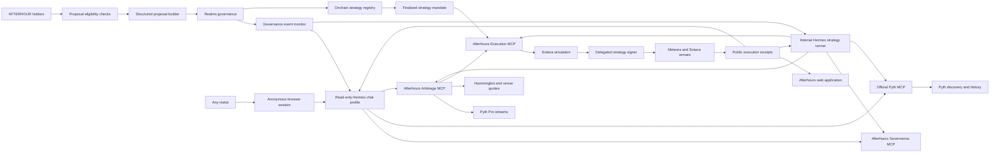

# Architecture

## Requirements

### Functional

- Holders approve strategies and upgrades through Realms.
- Anyone can converse with a read-only Afterhours agent without a wallet.
- Hosted Hermes reasons over active mandates and coordinates MCP tools.
- The first strategy compares Apple equity, xStocks Apple, and Ondo Apple feeds.
- The scanner verifies signals against executable Solana quotes.
- State-changing actions are simulated, policy checked, signed, and receipted.
- The system supports multiple strategy vaults and modular MCP capabilities.

### Non-functional

- No unrestricted treasury key is exposed to Hermes.
- Holder conversations cannot access execution or signing tools.
- Price freshness, market session, and confidence are explicit inputs.
- A service failure defaults to no trade.
- Every execution is attributable to a proposal, mandate, and agent run.
- The architecture remains usable if Hosted Hermes is later replaced.

## System diagram

## Trust boundaries

- Realms proposal state and executed proposal transactions are the source of governance authority.
- Agent classification controls Afterhours automation but cannot veto a passed Realms proposal.
- Proposal descriptions and external links are untrusted context, never authorization.
- Optional authority separation may be added later when different governance powers need different risk rules.
- Anonymous chat grants no governance authority; proposal eligibility is checked separately.
- The holder-chat Hermes profile has no execution or signing tools.
- Pyth is the independent market-data layer, not an execution venue.
- Venue quotes are executable only until their stated expiry.
- The Arbitrage MCP may propose plans but cannot bypass the Execution MCP.
- The delegated signer is limited to a funded strategy vault.
- The web application and Hermes transcript are presentation layers, not sources
  of authorization.

## Access separation

| Capability | Public chat | Internal agent | Execution service |
|---|---:|---:|---:|
| Pyth market data | Read | Read | Read |
| Arbitrage scanner and receipts | Read | Read | Read |
| Hummingbot market data | Public read | Read | Read |
| Hummingbot trading | No | No direct access | Policy-gated |
| Meteora DLMM data through Hummingbot | Public read | Read | Read |
| Meteora DLMM transactions through Hummingbot | No | No direct access | Policy-gated |
| Realms proposals and mandates | Read | Read | Required |
| Structured proposal drafting | Draft only | Draft only | No |
| Proposal event notifications | Read | Read | Internal trigger only |
| Voting or proposal approval | No | No | No |
| Strategy signing | No | No | Delegated signer only |

Tool absence is the security boundary. The holder profile does not receive write
tools, and the internal agent cannot call raw Hummingbot or Meteora execution.
Every write enters through the Execution MCP after a finalized Realms mandate
check and exact transaction simulation. The governance monitor may wake Hermes,
but it cannot authorize a trade. See [proposal-lifecycle.md](proposal-lifecycle.md).

## Failure model

Public chat uses isolated anonymous sessions with expiration, origin checks,
and IP/session rate limits. Replies fail closed if the dedicated Hermes API is
unavailable or exposes enabled tools. The current website receives backend
evidence; chat-to-MCP connections shown above are future read-only capabilities.

Trading halts when data is stale, Pyth confidence exceeds the mandate, quotes
expire, a venue fails, simulation changes, policy cannot be loaded, the mandate
expires, or the emergency pause is active.
