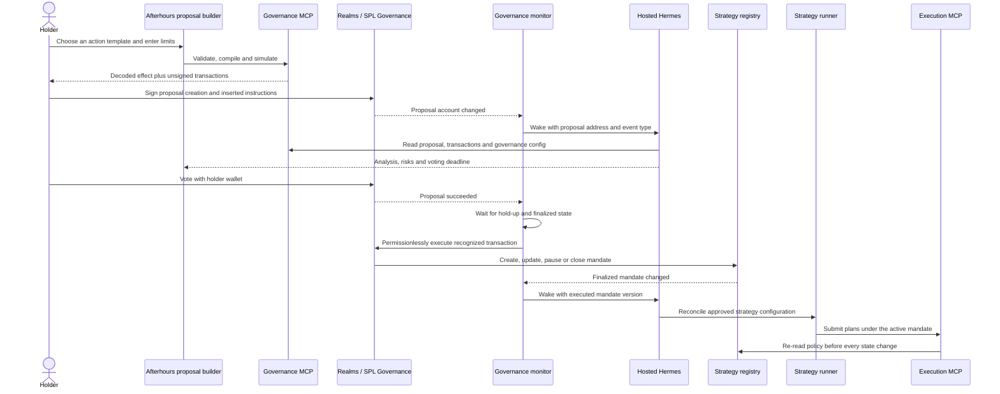

# Proposal lifecycle

> Deployment check: the current Afterhours Realm has a council, and its visible
> “Verify DAO Metadata” proposal uses the Multi-sig Vote Type. The community
> holder voting path described below is a design target until the deployed
> governance configuration and proposal creation flow are verified onchain.

## Decision

Afterhours accepts broad governance discussion, but automated action is limited to
versioned proposal types that contain a recognized onchain instruction. A title,
description, linked document, or agent interpretation can never authorize an
action.

## End-to-end flow

## Who may create proposals

### Recommended first release

Set Realms' onchain **minimum community tokens to create a proposal** to `X`.
Realms applies that threshold regardless of whether someone uses our portal or the
public Realms interface. Our portal authenticates the wallet, checks the same
threshold, and gives eligible holders an agent-assisted structured builder.

The agent prepares and validates the proposal, but the holder signs proposal
creation with their wallet. This preserves an onchain proposer identity and keeps
a proposal key out of Hermes. Holders above `X` can still create a general proposal
in Realms; the Afterhours executor will only act on recognized structured
instructions.

Choose `X` as governance voting weight, not merely a web-session balance. Depending
on the Realm configuration, holders may have to deposit or lock governing tokens
before Realms counts that weight.

### Exclusive proposal gateway, later

If the DAO wants only the Afterhours interface to originate community proposals,
a hidden button is insufficient. Use a voter-weight addin that issues action-scoped
weight for `CreateProposal` only after the user signs a one-time proposal intent and
passes the `X`-token check. The same plugin can preserve normal holder weight for
`CastVote`.

In that design, Hermes still does not hold a key. A deterministic proposal gateway:

1. Verifies the user's wallet signature, nonce, expiry, and token weight.
2. Validates the structured action and simulates its exact instructions.
3. Stores `requestedBy`, the signed intent hash, and the manifest hash.
4. Creates the community proposal using narrowly scoped proposal authority.
5. Has no treasury, trading, upgrade, or voting capability.

This requires a custom onchain voter-weight plugin and should follow the hackathon
MVP. A council-only proposal is not a substitute when community holders must vote,
because a council proposal belongs to the council voting population.

## Creating a proposal

1. An authenticated holder with at least `X` proposal weight opens the proposal
   builder or asks holder chat to prepare a draft.
2. The holder chooses a supported action instead of entering an arbitrary command.
3. The builder collects structured parameters, such as assets, venues, budget,
   maximum trade size, minimum net edge, slippage, loss limits, start time, expiry,
   and approved capability or code hashes.
4. The Governance MCP validates the values against DAO policy, verifies referenced
   artifacts, checks treasury state, compiles the exact Solana instructions, and
   simulates them.
5. The portal shows both the readable mandate and decoded instruction effects.
6. The holder signs the normal Realms proposal-creation transactions. Hermes never
   signs this step for the holder.
7. The proposal remains a Realms draft until its instructions and any signatories
   are complete. Signing it off opens voting.

## Proposals created directly in Realms

The public Realms interface enforces the same onchain proposal-weight threshold
`X`. A wallet below `X` cannot create a proposal. A wallet at or above `X` can
create one without using the Afterhours portal.

The governance monitor handles such a proposal as follows:

1. Detect it from the Realms account change.
2. Mark its source as `REALMS_EXTERNAL` in the Afterhours UI.
3. Fetch and decode every stored proposal transaction.
4. Run the same deterministic review.
5. Show `VALID` if it contains a recognized, policy-compliant Afterhours action,
   or `INVALID` with `UNRECOGNIZED_INSTRUCTION` and the failed checks otherwise.
6. Never start Afterhours automated execution for an invalid external proposal.

This classification is not a veto. The external proposal remains a normal Realms
proposal and holders may vote on it. If it passes, its hold-up period elapses, and
its instruction can use authority controlled by that governance, any caller may
execute the stored transaction permissionlessly.

For the first release, this is expected governance behavior: eligible holders may
propose, holders vote, and a passed proposal expresses the DAO's decision. The
agent's `VALID` or `INVALID` label controls Afterhours automation and explains
risk; it does not override the DAO vote. Any call to the Strategy Registry must
still satisfy that program's onchain constraints.

Separating strategy, treasury, and upgrade authorities is an optional future risk
control. It is useful only if the DAO wants different proposal thresholds, voting
rules, or hold-up periods for different powers. It is not required for the
hackathon architecture.

A custom action-scoped voter-weight plugin is required only if the DAO later wants
to prevent eligible holders from creating proposals through the public Realms UI
at all.

## Proposal status in the web application

The UI keeps review validity separate from the Realms lifecycle and displays
whether the proposal came from `AFTERHOURS_PORTAL` or `REALMS_EXTERNAL`.

### Review status

| Status | Meaning | Submit action |
|---|---|---|
| `PENDING` | No review has run. | Disabled |
| `REVIEWING` | Agent explanation and deterministic checks are running. | Disabled |
| `VALID` | Every required check passed for the displayed manifest hash. | Enabled |
| `INVALID` | One or more required checks failed. | Disabled; show reasons and fixes |
| `STALE` | Chain state or draft content changed after review. | Disabled; review again |

The agent explains the proposal and its risks. Schema, proposal weight, program
allowlist, policy bounds, treasury state, artifact existence, instruction matching,
and simulation determine validity. `VALID` means ready to submit for a vote; it
does not mean the proposal has DAO approval.

### Realms lifecycle

After the holder signs, the same card shows the canonical onchain state separately:
`DRAFT`, `SIGNING_OFF`, `VOTING`, `SUCCEEDED`, `EXECUTABLE`, `COMPLETED`,
`DEFEATED`, `CANCELLED`, or `EXECUTING_WITH_ERRORS`. The card includes the
proposal address, manifest hash, reviewing slot, requested-by wallet, voting
window, and transaction links.

## Supported actionable proposal types

The first schema supports:

- `CREATE_STRATEGY`
- `UPDATE_STRATEGY`
- `PAUSE_STRATEGY`
- `RESUME_STRATEGY`
- `FUND_STRATEGY_VAULT`
- `CLOSE_STRATEGY`
- `AUTHORIZE_MCP_VERSION`
- `AUTHORIZE_RUNTIME_BUILD`

Each proposal carries a schema version and compiles to an instruction for an
allowlisted program. Strategy actions write a durable mandate account. Upgrade
actions write an approved artifact hash or release digest before a deployment
service can use it.

## Actionability gates

A proposal is actionable by the Afterhours automation only when all gates pass:

1. **Recognized instruction** — the proposal transaction targets an allowlisted
   program and instruction discriminator.
2. **Valid schema** — the payload decodes into a supported, versioned action.
3. **Valid bounds** — assets, venues, budgets, timing, risk limits, MCP versions,
   and code hashes conform to DAO policy.
4. **Deterministic effect** — the displayed mandate hash matches the instruction
   payload stored in the Realms proposal transaction.
5. **Successful simulation** — the exact instruction set simulates against recent
   state before proposal sign-off and again before execution.
6. **Successful vote** — Realms reports the proposal as succeeded.
7. **Hold-up elapsed** — any configured execution delay has passed.
8. **Finalized re-read** — the executor fetches the proposal and proposal
   transaction from finalized chain state immediately before execution.
9. **Replay protection** — the proposal transaction and resulting mandate version
   have not already been processed.

Realms intentionally permits general-purpose proposals. A holder who meets the
Realm threshold may still create one outside the Afterhours portal. The monitor
may summarize it, but the executor marks it `UNRECOGNIZED` and takes no automated
action. This is the reliable boundary: we constrain what the agent executes rather
than assuming every proposal is machine actionable.

## Agent notification

The governance monitor uses a Solana WebSocket account/program subscription for
low-latency changes and polling as a recovery path. MCP remains request-response;
it is not the push channel.

For every change, the monitor:

1. Waits for the configured commitment.
2. Decodes the proposal and its stored proposal transactions.
3. Produces an idempotent event keyed by proposal address, state, transaction
   version, and observed slot.
4. Persists the event to an outbox or job queue.
5. Starts a Hosted Hermes run with only the event type and onchain addresses.
6. Hermes reads canonical details through the Governance MCP.

| Event | Agent behavior |
|---|---|
| `PROPOSAL_CREATED` | Analyze the exact transactions and publish a readable risk summary in the app. |
| `PROPOSAL_VOTING` | Refresh impact, deadline, and voting status. |
| `PROPOSAL_SUCCEEDED` | Record success and wait for the hold-up period. |
| `PROPOSAL_EXECUTABLE` | Request execution only if every actionability gate passes. |
| `PROPOSAL_EXECUTED` | Reload the finalized mandate and reconcile the runner. |
| `PROPOSAL_DEFEATED_OR_CANCELLED` | Close the pending job without action. |

A notification is a reason to inspect state. It is never authorization by itself.

## Voting policy

The initial release does not delegate voting power to Hermes and exposes no vote
method in its toolset. Holders vote in Realms. SPL Governance supports delegated
agent voting, but that should be a later, separately approved policy with an
isolated wallet, published decision rules, rate limits, complete logs, and an
immediate revocation path.

## Untrusted content

Proposal descriptions and external links are untrusted input. Hermes may summarize
them, but it must not treat their text as instructions. Program IDs, account metas,
instruction data, proposal state, and the finalized mandate account determine what
the system may do.
