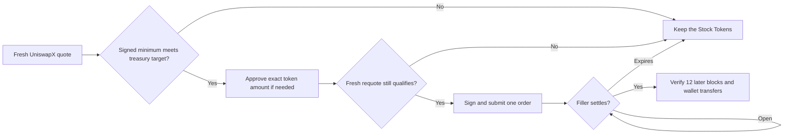

# How the Afterhours agent works

This describes the **implemented wallet agent** in this repository as of September 21, 2026. The [DAO architecture](architecture.md) describes a future custody and governance model; the current agent wallet is not controlled by a deployed DAO. The agent's trade decisions are deterministic code and configured limits. The optional OpenAI integration drafts social wording; it does not select trades or sign transactions.

## The short version

```text
$AFTERHOURS creator fees -> Pons USDG escrow -> agent wallet
agent checks Oracle and approved pools -> pays x402 for a fresh signal
agent buys AAPL or NVDA Stock Tokens in a pinned Uniswap v3 pool
agent holds the tokens and records a pre-open treasury estimate
at the NYSE open, agent asks UniswapX for a stock-to-USDG quote
if the signed minimum payout clears its target, agent posts an order
a filler may settle that order -> USDG returns to the same wallet
agent verifies the order and onchain receipt before recording a sale
after all positions are sold, agent calculates cumulative gross trading spread
if positive and cash reserve passes, agent buys $AFTERHOURS with USDG
agent burns exactly the purchased tokens and publishes both receipts
```

Stock Tokens are tokenized exposure, not shares of the underlying companies. A price gap against the last NYSE close is a signal, not a guaranteed arbitrage profit.

## Funding, screening, and buying

1. **Receive funds.** Pons V2 creator fees accrue in a USDG escrow. After a Pons sweep makes them claimable, the agent verifies the token launch, fee recipient, and USDG pairing, then claims to its dedicated wallet. The agent does not perform the Pons sweep. Its private spending ledger credits only verified claims; direct wallet deposits are not labeled creator fees. A separate, capped wallet-funded mode exists for earlier funding.
2. **Check markets for free.** Each cycle fetches the [After-Hours Oracle](https://afterhoursoracle.xyz/) board for the NYSE state and last close. It quotes a configured buy size through the two pinned AAPL/USDG and NVDA/USDG Uniswap v3 pools and verifies each pool's contract identity. The production cycle interval is configured with `POLL_MINUTES`.
3. **Shortlist a discount.** A token must be marked tradable, its reference close and board must be fresh, and its executable pool quote must clear `MIN_DISCOUNT_PCT`. The current default screen is 0.6% below the last NYSE close. The same discount is enforced again on the final route.
4. **Pay only for a shortlisted signal.** The agent checks its USDG budget and the Oracle's x402 challenge before paying. It accepts only the configured Robinhood Chain USDG asset, recipient, and `MAX_API_FEE_USDG` cap. The paid signal must still identify the same ticker, a fresh last close, and a closed NYSE session. A failed free route check costs no paid Oracle request.
5. **Buy directly in the approved pool.** It requotes, checks the final execution price and slippage floor, and submits a USDG-to-Stock-Token swap through the pinned Uniswap v3 router. It buys at most one candidate per evaluation cycle. `MIN_EXPECTED_NET_PROFIT_PCT=0` makes its modelled close-price return **informational**, so a negative projection does not by itself block a buy.

The upstream [After-Hours Dip Agent MCP server](https://glama.ai/mcp/servers/glabun002/after-hours-dip-agent) currently supplies a wallet-status check. The paid signal and buy execution are performed by this repository's Oracle, policy, and Uniswap v3 code; the MCP server is not an autonomous trade planner.

The wallet needs ETH for creator-fee claims, approvals, and direct pool swaps. If `AUTO_GAS_REFILL_ENABLED=true` and the wallet still has enough ETH to start a transaction, the agent can swap a bounded amount of eligible USDG for ETH through its pinned ETH/USDG pool. Oracle payments spend USDG only after a candidate passes the free checks. Requesting a UniswapX sell quote does not itself sell tokens or pay the Oracle.

## What “treasury value” means

The public portfolio estimate is wallet USDG cash plus a **full-position Uniswap v3 stock-to-USDG quote** for each held Stock Token. It excludes ETH gas. It is an estimate of what those holdings might sell for through the approved pools, not a confirmed sale or a UniswapX fill.

The agent saves the last complete, fresh valuation before 9:30 a.m. Eastern on the same trading day and locks it as the opening benchmark. It needs a recent snapshot for both AAPL and NVDA, even when one balance is zero. If that snapshot is missing, stale, or inconsistent, it does not create a sell order. Later creator-fee claims do not lower the stock sale target or masquerade as trading gains.

For a proposed sale, the code requires:

```text
locked pre-open cash
  + USDG from this benchmark's already confirmed Stock Token sales
  + signed worst-case USDG output from the proposed UniswapX order
  + fresh sell estimate of any other Stock Tokens still held
>= locked pre-open treasury value + EXIT_MIN_PROFIT_USDG
```

The default minimum improvement is **1 USDG**. Existing cash appears on both sides of this comparison and is not added to the sale target twice. For example, if the locked treasury estimate were 3,524.86 USDG, the counted post-sale value would need to reach at least 3,525.86 USDG. The agent uses the actual new pre-open snapshot, not a screenshot or an old dashboard figure.

**Acquisition cost is separate.** Purchase receipts and USDG spent are recorded to help calculate a later realized result. They do not set this opening sell threshold. Improving a market-value estimate does not prove the trade made money after purchase cost, Oracle payments, and gas.

## The UniswapX sale: quote, order, filler, receipt

**Yes: the agent quotes, may submit a signed order, and then waits for a filler.** A filler is an independent trader or solver that can supply the required USDG in exchange for the agent's Stock Tokens. The filler submits the settlement transaction to Robinhood Chain when the order's terms work for it. The agent does not call a direct pool swap for this exit. A quote is neither a submitted order nor a guaranteed fill. [UniswapX overview](https://developers.uniswap.org/docs/liquidity/uniswapx/overview)



1. **Opening gate.** `EXIT_ENABLED` must be true. A fresh Oracle board must report the NYSE open, and the time must be within the first `EXIT_WINDOW_MINUTES` after 9:30 a.m. Eastern. The default window is 60 minutes. The agent also reconciles any previously submitted order before considering another.
2. **Prove what it owns.** A read-only receipt scan reconstructs the Stock Tokens bought through the approved Uniswap v3 router and the USDG paid. It compares acquired quantities, less confirmed UniswapX sales, with the wallet's current balances. An unexplained transfer or missing receipt stops the exit. The scan cache is refreshed while the NYSE is closed to reduce work at the open.
3. **Request a fresh quote.** For the **entire held balance of one ticker**, the agent calls Uniswap's `/v1/quote` for Stock Token input and USDG output on Robinhood Chain, allowing only a `DUTCH_V3` UniswapX route. It quotes the other still-held stock through its approved v3 pool for the treasury comparison.
4. **Validate the worst case.** It checks the chain, pinned reactor and Permit2 contracts, exact input amount, wallet recipient, deadline, encoded order, and Permit2 signing witness. The order's minimum USDG output after the auction curve has fully moved must meet the treasury target. A high initial quoted output alone is insufficient.

   For example, if the proposed sale needs at least 107 USDG, an order that starts at 111 USDG but can decay to 106 USDG is rejected. The agent cannot assume a filler will arrive while the higher price is available.
5. **Approve and requote if needed.** If the Stock Token has insufficient allowance to Permit2, the agent sends an onchain approval for the exact held quantity. That approval costs wallet ETH gas even if the later UniswapX order never fills. It then requests and validates a **new** quote because the first quote may have aged during approval.
6. **Sign and submit once.** The agent signs the checked Permit2 typed data, writes the pending order ID and terms to its persistent ledger **before** calling Uniswap's `/v1/order`, and submits the signed quote. It permits one pending exit order at a time. The token stays in the agent wallet until a filler settles the order. Submitting the order does not mean it sold. [Uniswap order API](https://developers.uniswap.org/docs/api-reference/post_order)
7. **Wait and reconcile.** On later cycles the agent asks `/v1/orders` for that order ID. While the status is open or unverified, it does not create another order. If the API response is missing or the submission result is uncertain, the pending record also blocks an automatic duplicate.
8. **Confirm a fill.** A reported fill counts only after 12 additional blocks have been mined and the order's settlement amount matches the wallet's Stock Token debit and USDG credit in the onchain receipt. The agent then records the verified sale. It can consider the other ticker on a later cycle. [Uniswap order-status API](https://developers.uniswap.org/docs/api-reference/get_order)

Uniswap's Dutch auction can start with a higher USDG output and move down toward the signed minimum, making the order more attractive to fillers. A filler may settle within that range; no filler is obliged to do so. If the order **expires**, the agent may seek a new qualifying quote while still inside the opening window. A cancelled, erroneous, insufficient-funds, or unknown final status stops automatic progress for review. After the opening window, it still reconciles an existing pending order but creates no new sale order. The filler pays settlement gas; the agent may have paid its own ETH for the initial token approval. [UniswapX overview](https://developers.uniswap.org/docs/liquidity/uniswapx/overview), [order lifecycle](https://developers.uniswap.org/docs/api-reference/post_order)

## Profit-funded buyback and burn

When `BUYBACK_ENABLED=true`, the agent acts after confirmed sales, once **both Stock Token balances are zero** and no sell order is pending. It uses cumulative realized gross trading spread, so a trading loss must be recovered before a later gain can fund a buyback. The spendable amount is:

```text
confirmed USDG sale proceeds - verified acquisition USDG
- prior buyback USDG spend
```

The agent also keeps at least 100 USDG cash, spends no more than 100 USDG in one swap, and waits until at least 1 USDG is available. These are defaults configured by the `BUYBACK_*` settings. Creator fees, direct deposits, unsold stock estimates, and existing wallet tokens do not increase the buyback budget. **Oracle payments and ETH gas are separate expenses and are not deducted from this gross-spread allocation.** Thus a buyback can occur even when the overall strategy has a net loss after those expenses.

It verifies the launched token `0x6918EcC39996DAE959FBb7aAb1F6e926f285eBd4` and the [approved Pons USDG pool](https://app.uniswap.org/explore/pools/robinhood/0x5054ee8f684356b9e050d6322625c5480d43d64abbb4126c3857e8453786d6a8), checks the pool ID, quotes the exact USDG amount through that Robinhood Chain Uniswap v4 pool, rejects excessive price impact, and simulates the bounded Universal Router swap. A signed transaction and its exact bytes are written to `.data/buyback.json` before broadcasting. After 12 later blocks, the agent checks the USDG debit and newly purchased `$AFTERHOURS` in the receipt. It calls the token's supply-reducing `burn(uint256)` for **only that purchased quantity**, waits another 12 blocks, checks the burn transfer and lower total supply, and then records the completed result. An uncertain transaction is reconciled using its saved signed bytes; it does not create another buyback while one is pending. Completed receipts and totals appear at `/buybacks.json` and on the dashboard. With X posting enabled, one factual post is queued only after the completed burn, including the spent USDG and both transaction hashes. No planned or pending buyback is announced as complete.

This is execution by the **current agent wallet**. The locally implemented DAO contracts have not been deployed and do not approve or control these wallet transactions. The wallet's older `$AFTERHOURS` balance is not burned. A buyback is not a holder payout or a guarantee of price appreciation.

## What is recorded and what is still planned

| Item | Current behavior |
| --- | --- |
| Trading custody | One dedicated agent wallet holds USDG and Stock Tokens. |
| Purchase route | Direct pinned Uniswap v3 USDG/Stock Token pools. |
| Opening sale route | Signed UniswapX Dutch V3 order; a filler must settle it. |
| Public evidence | `/status.json`, `/activity.json`, `/history.json`, `/buys.json`, `/exits.json`, `/buybacks.json`, the decision page, wallet balances, and explorer links. The stock detail chart uses recorded pool quotes; the buy list is reconstructed from confirmed agent swap receipts by a separate read-only background index. It can show “index pending” until the first scan finishes. |
| Private recovery state | `.data/state.json` for spending, `.data/exit-preopen.json` and `.data/exit-benchmark.json` for the opening reference, `.data/exit-basis.json` for sell eligibility, `.data/buy-history.json` for the read-only public receipt index, `.data/exit-orders.json` for pending and settled exits, and `.data/buyback.json` for pending and completed buybacks and burns. Keep the persistent volume and one agent replica. |
| Social posts | X posting is optional and governed by separate API credentials and limits. The ten-buy milestone mode posts after every ten confirmed buys. Each confirmed UniswapX sale is separately announced once the fill is verified and written to the exit ledger. A buyback post waits for the confirmed burn and includes both receipt hashes. An explicit X daily-post-limit rejection is retried on a later ET day; uncertain responses are not retried automatically. OpenAI, when configured, can draft factual buy wording only. |
| DAO voting and custody | Governance and transitional treasury contracts exist locally but are **not deployed or connected** to this wallet. Holder votes do not currently control the agent's trade rules or assets. |
| Buyback and burn | Optional wallet-agent flow: confirmed cumulative gross trading spread before Oracle and gas buys `$AFTERHOURS` from the verified USDG pool and burns purchased tokens. No holder payout occurs. DAO control remains undeployed. |

The public `policy.exitEnabled` and `policy.buybackEnabled` fields show which automatic paths are enabled. `exitBenchmark` appears after an opening benchmark has been captured. A healthy `/healthz` or completed market check proves the service ran, not that a UniswapX order filled or a buyback burned tokens.

## Main controls

| Setting | Purpose |
| --- | --- |
| `LIVE_TRADING` | Allows paid calls and signed trades; required for enabled exits. |
| `FUNDING_MODE`, `PONS_TOKEN_ADDRESS`, `MIN_CLAIM_USDG` | Select and verify the source of spendable USDG. |
| `BUY_USDG`, `MIN_DISCOUNT_PCT`, `MIN_EXECUTION_DISCOUNT_PCT`, `MAX_SLIPPAGE_PCT` | Bound entry size and execution price. |
| `MAX_API_FEE_USDG`, `MAX_API_DAILY_USDG`, `MAX_DAILY_USDG` | Bound Oracle and buy spending. Zero daily caps mean no daily cap, while earned balance still constrains spending. |
| `EXIT_ENABLED`, `EXIT_WINDOW_MINUTES`, `EXIT_MIN_PROFIT_USDG` | Enable opening orders, limit their time window, and require improvement over the locked treasury estimate. |
| `BUYBACK_ENABLED`, `BUYBACK_*` | Enable gross-spread buyback and burn, with minimum size, maximum size, cash reserve, slippage, and price-impact caps. |
| `UNISWAP_API_KEY` or `UNISWA_API_KEY` | Authenticate Uniswap Trading API quote, order, and status requests. Keep the value in private environment variables. |
| `POLL_MINUTES` | How often the agent checks market and pending-order status. |

The code for this behavior is in [the cycle runner](src/index.js), [entry policy](src/policy.js), [Oracle payments](src/oracle.js), [Uniswap v3 routes](src/v3.js), [opening benchmark](src/exit-benchmark.js), [sale policy](src/exit-policy.js), [UniswapX order lifecycle](src/exit.js), and [buyback execution](src/buyback.js). See [DAO architecture](architecture.md) for future governance control.
