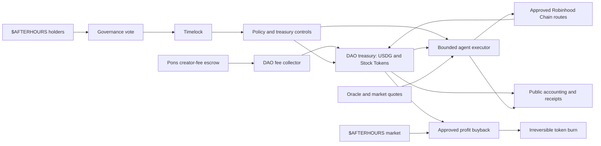
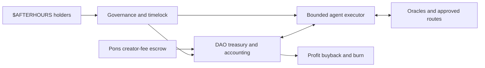

# Afterhours DAO architecture

**Status:** Proposed DAO design. The voting wrapper, Governor, and transitional treasury contracts are implemented and tested locally but are not deployed. The present wallet agent has optional UniswapX sales and a profit-funded `$AFTERHOURS` buyback and burn flow; neither is controlled by the DAO contracts. Check [agent status](https://agent-production-02cc.up.railway.app/status.json) and onchain receipts for live results.

For the mechanism running in the current wallet agent, including UniswapX quote, order, filler, and receipt states, see [How the Afterhours agent works](AGENT.md).

## Thesis

Creator fees from `$AFTERHOURS` accumulate in USDG during the week. Token holders govern the treasury's allocation policy and risk limits for the next period. After the NYSE closes, the agent screens approved Robinhood Chain Stock Token markets and deploys capital only when a trade passes that policy. It seeks a fresh, profitable exit quote when the market opens. Returned principal funds later trades; an approved share of realized net profit funds `$AFTERHOURS` buybacks and irreversible burns. Every claim, trade, sale, buyback, and burn should have an independently verifiable transaction.

A price below the last NYSE close is a candidate signal, not a locked arbitrage. A position has no realized profit until an actual sale settles for more than its full allocated cost. A position may remain open if no profitable exit is available.

## Present system and proposed system

| Concern | Present system | Proposed DAO system |
| --- | --- | --- |
| Custody | One agent private-key wallet holds USDG and Stock Tokens. | A Robinhood Chain treasury contract holds assets. The agent has bounded execution authority. |
| Creator fees | Pons V2 pays the verified wallet, which claims USDG. | Future fees reach a DAO-controlled recipient or collector. Existing accrued fees are reconciled during migration. |
| Funding ledger | A private file is bound to the current wallet and distinguishes creator fees from earlier wallet funding. | An auditable treasury ledger records fee income, contributed capital, trading cost basis, expenses, and realized results separately. |
| Decisions | Operator configuration sets the watchlist, routes, budgets, and execution rules. | Holders approve a periodic mandate; the agent makes individual trade decisions within enforceable limits. |
| Trading | The agent buys AAPL and NVDA through approved USDG pools. The optional opening exit checks actual purchase receipts and UniswapX V3 worst-case USDG proceeds before submitting a sell order. | The DAO sets approved assets and execution policy, with proceeds returned to a DAO treasury and verified profit accounting. |
| Token value mechanism | The optional agent-wallet flow spends cumulative realized gross trading spread before Oracle and gas to buy `$AFTERHOURS` in its verified USDG pool and burn exactly the purchased quantity. It is operator-configured, not holder-governed. | A holder-approved share of realized net profit purchases `$AFTERHOURS` through a verified route and permanently removes the acquired tokens from circulation. |

The current code assumes that the signer, Pons creator-fee recipient, ledger address, and trading wallet are the same address. Changing the recipient or moving assets without changing these checks would stop live operation. No funds should be moved as a side effect of adopting this document.

## Components and control



### Simplified component view



- **Holders:** vote on the next period's asset universe, target allocation ranges, treasury reserve, spending limits, and the share of realized profit assigned to buybacks. They do not vote on every quote, trade, or buyback execution.
- **Governance and timelock:** convert passed votes into delayed changes to treasury policy. The implemented `AfterhoursVotes` contract wraps the deployed token 1:1 and records delegated historical voting power; it has no minimum lock and is freely redeemable. `AfterhoursGovernor` uses those snapshots and routes successful proposals through an OpenZeppelin Timelock. These contracts become binding only after deployed treasury controls grant authority to the Timelock.
- **Treasury:** the implemented transitional contract can claim Pons USDG fees, hold assets, and migrate atomically to a checked successor while updating the Pons creator-fee recipient. Its two-step owner is the temporary administrator and can later become the Timelock. The bounded trading executor and mandate enforcement remain to be implemented.
- **Agent:** screens, quotes, pays for permitted data, and executes within the active mandate. The agent cannot change the mandate, select an arbitrary asset recipient, or withdraw principal for itself.
- **Emergency authority:** can pause new trades and revoke the executor after a fault. Resuming or changing the mandate follows the documented governance process. Emergency authority should not be able to appropriate treasury assets.
- **Public accounting:** shows onchain balances and receipts alongside the current policy, cost basis, realized profit, buyback spend, tokens purchased, and tokens burned. Offchain analysis is labeled as such.

## Operating cycle

1. **Set the mandate.** Holders vote before the next weekly period. The policy takes effect after a timelock and remains fixed during that period unless an approved emergency pause applies.
2. **Accumulate and classify funds.** Pons creator fees accrue in USDG. A verified claim credits fee income. Earlier wallet deposits, direct gifts, sales, and trading proceeds have separate accounting categories; a deposit does not become creator revenue merely because it reaches the treasury.
3. **Allocate after hours.** During each eligible session after the NYSE close, the agent checks the approved Stock Token addresses, market tradability, pool identity and liquidity, fresh reference data, executable quote, price impact, and available budget. It can buy only within the current DAO mandate.
4. **Seek an exit.** During the first configured hour after a fresh Oracle board confirms the NYSE is open, the optional sell path locks the last complete pre-open treasury value and requests a UniswapX V3 quote for each held position. Read-only Robinhood Chain quote requests have confirmed the route. An order's signed minimum USDG output must improve the locked treasury stock value after accounting for prior settled sales and remaining stock estimates. Existing wallet cash is already included in the benchmark and is not added to the stock sale target. Verified acquisition spend remains in the ledger for realized-profit accounting but is not the sale threshold. Improving a market-value snapshot does not itself establish net trading profit after all historic costs. The agent confirms each fill from the order's settled amount and the onchain receipt. A quote does not guarantee a fill.
5. **Settle and recycle.** Confirmed sale proceeds return to the treasury. The ledger attributes proceeds against allocated principal and execution costs, then records realized profit or loss. The active mandate splits positive net profit between reinvestment, reserve, and a buyback budget. Unrealized gains and creator-fee principal are not labeled as trading profit.
6. **Buy back and burn.** When the accumulated buyback budget exceeds the approved minimum, the agent obtains a fresh executable quote on an approved `$AFTERHOURS` route. It buys only within the active price-impact, slippage, liquidity, and spending limits. The acquired tokens are then irreversibly burned, with the buyback and burn receipts linked in the public ledger.

Weekly governance and per-trade execution run on different clocks. A weekly vote sets boundaries for the next period; the agent can check markets more frequently without asking holders to approve each trade.

## Risk rules

The DAO sets parameter values; the treasury or executor guard enforces them. Values in the current agent configuration are implementation defaults, not automatically approved DAO policy.

| Rule | What it controls |
| --- | --- |
| Treasury reserve | Minimum USDG retained for Oracle fees, gas, obligations, and future trading. |
| Asset exposure | Maximum share of treasury value in one Stock Token or sector, and which assets may be held. |
| Purchase size | Maximum USDG per order and maximum total capital deployed under a mandate. A daily purchase count is optional, not inherent to this design. |
| Approved venues | Verified token contracts, pools, routers, payment recipients, and treasury recipient address. |
| Entry quality | Minimum executable discount or other approved signal, fresh data, pool liquidity, maximum price impact, and maximum swap slippage. |
| Exit quality | Fresh executable quote and minimum positive net proceeds after cost basis, Oracle charges, pool fees, price impact, and gas. No forced sale at the market open. |
| Data and gas spending | Maximum charge per Oracle request and bounded gas refill authority. |
| Buyback execution | Maximum USDG per buyback, approved `$AFTERHOURS` token and route, minimum liquidity, maximum price impact and slippage, execution deadline, and verified burn destination. |
| Circuit breakers | Pause on stale data, lost ledger integrity, failed pool verification, disputed transactions, or a material treasury drawdown. |

Robinhood notes that Stock Token tradability can vary by asset and session; the executor must check it before placing a trade. The DAO should obtain legal review before operating or marketing an automated profit-funded buyback program.

## Profit-funded buyback and burn

For the proposed DAO, each confirmed sale attributes a documented cost basis to the quantity sold and calculates:

```text
realized net result = USDG actually received
                    - allocated acquisition cost
                    - attributable Oracle payments
                    - buy and sell execution costs, including gas
```

The current wallet agent instead allocates cumulative **gross trading spread**: confirmed sale proceeds less verified acquisition cost and prior buyback spend. Oracle payments and ETH gas are excluded from that calculation and remain separate expenses. It requires all Stock Token positions to be closed and retains at least 100 USDG cash. It limits each buyback to 100 USDG and verifies the burn after 12 later blocks. The future DAO must separately approve its cost-basis convention, reserve floor, interval, and share of realized net profit assigned to buybacks. A period with no positive gross trading spread after earlier trading losses creates no wallet-agent buyback budget. The dashboard must distinguish Pons creator-fee revenue, treasury principal, unrealized portfolio value, realized gross trading spread, available buyback budget, completed buybacks, and confirmed burns.

The selected holder value mechanism is:

1. **Buyback and burn from realized profit:** the treasury uses an approved share of realized, attributable net profit to purchase `$AFTERHOURS` on an approved route. The purchased tokens are permanently removed from circulation. The mechanism does not distribute USDG, create a redemption right, or guarantee a token price.

The buyback budget must never include trading principal, unrealized gains, funds reserved for open positions, Oracle or gas reserves, direct wallet deposits that have not been classified as revenue, or profit needed to recover earlier realized losses. A buyback is complete only after both the swap and the irreversible removal of the purchased tokens are confirmed onchain.

The wallet flow verifies the deployed `$AFTERHOURS` token's supply-reducing `burn(uint256)` and checks the resulting onchain supply. A future DAO executor must preserve this verification.

Pons V2's optional launch buyback is a separate mechanism: purchased tokens vest to the creator and protocol. It must not be described as a holder distribution or burn.

## Migration path

1. Reconcile the present wallet and private ledger against onchain Pons claims, Oracle payments, USDG deposits, Stock Token buys, and current balances. Classify preexisting wallet-funded assets before assigning any of them to DAO custody.
2. Specify the DAO's governance rules, emergency powers, fee allocation, realized-profit policy, buyback limits, and burn method. Obtain legal review before operating or marketing the mechanism.
3. Review the implemented transitional treasury and governance contracts, then implement the DAO policy guard, vote-to-execution path, realized-profit accounting, buyback, and burn mechanism on a test network. The current wallet's optional sale and buyback paths are not yet DAO controlled.
4. Publish contracts, limits, and a migration balance sheet for holder review. Validate the end-to-end process with small, bounded amounts before migrating the live treasury.
5. During a deliberate cutover, stop the current agent, reconcile its final state, transfer only approved assets, redirect future Pons creator-fee payouts where supported, and start the DAO-compatible executor with a new ledger. Resume only after the treasury balances and permissions match the published plan.

The current private ledger must remain as an audit record. It cannot simply be reused under another wallet address or silently recast prior wallet deposits as DAO fee income.

## Failure modes and operating constraints

| Failure | Required response |
| --- | --- |
| Agent key compromised | Revoke executor authority and pause new trades without exposing unrestricted treasury withdrawal. |
| Oracle, RPC, or quote stale/unavailable | Skip the trade; do not substitute an unapproved price or venue. |
| Pool liquidity vanishes or slippage rises | Requote and reject if the route leaves the active mandate. |
| Sale cannot clear the locked treasury-value target | Keep the position, mark it at a clearly labeled estimate, and record no realized profit. |
| Claim, sale, buyback, or burn result is uncertain | Reconcile transaction receipts before retrying or crediting the ledger. Never repeat a buyback until the prior transaction state is known. |
| Governance capture or bad proposal | Require quorum, a voting period, a timelock, and visible proposal payloads; keep emergency pause separate from treasury withdrawal. |
| Buyback route is illiquid or too expensive | Retain the approved buyback budget in USDG and retry only when a later quote passes the active execution rules. |
| Token cannot reduce total supply | Use only a governance-approved irreversible sink and report the action as removal from circulation rather than a supply-reducing burn. |

Auditability and correct custody matter more than scaling to many agent replicas. One reconciled executor should operate per strategy until onchain nonce, reservation, and accounting coordination are designed.

## Architecture decisions

### ADR-001 — Treasury contract owns assets

**Status:** Proposed. **Context:** The present single-key wallet can sign any transfer. **Decision:** Put DAO assets under a contract with bounded agent execution rights and delayed governance updates. **Trade-off:** Stronger custody and verifiable control require contract review and a careful migration. An offchain vote alone does not make the current wallet DAO-controlled.

The first treasury implementation deliberately starts paused under a two-step administrator so the current operation can be migrated in stages. A migration is allowed only to a deployed successor that names the predecessor and matches its Pons factory, fee escrow, launched token, quote token, and owner. The same transaction claims pending fees, updates the Pons creator-fee recipient, moves USDG, listed ERC-20 assets, and native ETH, and records acceptance on the successor. The predecessor is permanently retired. Once governance is ready, ownership transfers to the Timelock through the same two-step path; no separate administrator remains.

### ADR-002 — Holders set mandates, agent selects trades

**Status:** Proposed. **Context:** After-hours quotes change faster than a governance vote. **Decision:** Vote on periodic allocation ranges and risk limits; let the agent execute individual trades within them. **Trade-off:** The agent retains timing discretion, but cannot exceed its authorized assets, routes, amounts, or recipients.

### ADR-003 — Buy back and burn only from realized, attributable profit

**Status:** Gross-spread version implemented for the agent wallet; net-profit DAO enforcement proposed. **Context:** Creator fees, direct deposits, and mark-to-market gains are different from confirmed trading spread. **Decision:** The wallet agent allocates confirmed sale proceeds less acquisition cost and prior buyback spend, with a cash reserve. Oracle and ETH costs remain separately reported and can make total net performance negative. A future DAO may adopt net-profit accounting under holder-approved policy. **Trade-off:** The wallet version can buy back despite net losses, while still avoiding unrealized gains and direct-deposit principal as the stated source.

## References

- [Robinhood Chain Stock Tokens, tradability, and restrictions](https://docs.robinhood.com/chain/stock-tokens/)
- [Pons V2 creator fees, fee recipient, and optional buyback](https://docs.ponsfamily.com/v2)
- [OpenZeppelin governance and timelock design](https://docs.openzeppelin.com/contracts/5.x/governance)
- [Safe's bounded agent spending pattern](https://docs.safe.global/home/ai-agent-quickstarts/agent-with-spending-limit)
- [Dubai VARA virtual asset issuance rules, if applicable to the issuer and activity](https://rulebooks.vara.ae/rulebook/virtual-asset-issuance-rulebook)
